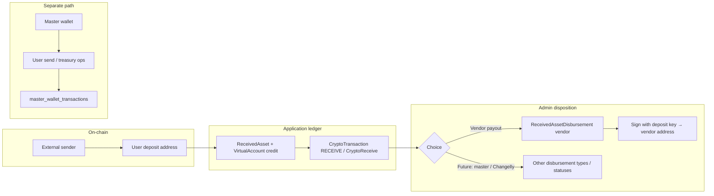

# Transaction tracking & received-asset architecture

This document describes how **on-chain crypto deposits** are tracked in the admin panel, how they differ from **master-wallet** activity, and which **HTTP operations** (endpoints) support listing, detail, timeline, vendor payout, and vendor directory management.

---

## 1. Architecture overview

### 1.1 Two different “sources of funds”

| Concept | Where funds live | Typical use | Ledger table (admin visibility) |
|--------|-------------------|-------------|----------------------------------|
| **Customer deposit (received asset)** | User’s **deposit address** (linked to `VirtualAccount` / Tatum) | Incoming deposits; balance in app; admin may route liquidity | `received_assets`, `crypto_transactions` (type `RECEIVE`), **`received_asset_disbursements`** for admin-initiated outflows |
| **Master wallet** | Platform **master** address per chain | User **on-chain send** (customer sends out); consolidations; ops from treasury | `MasterWallet`, **`master_wallet_transactions`** |

**Rule of thumb**

- **User initiates on-chain send** → implementation uses the **master wallet** (not the user’s address as the signing source for that product flow).
- **Admin sends deposit-side funds to a vendor** → implementation signs from the **customer’s deposit private key** and records a **`ReceivedAssetDisbursement`**, **not** a `MasterWalletTransaction`.

### 1.2 Deposit lifecycle (high level)

1. **On-chain tx** arrives at the user’s deposit address → Tatum webhook processing creates/updates ledger rows.
2. **`ReceivedAsset`** row ties the webhook deposit to `txId` (on-chain hash), `accountId`, optional `userId`, and a **`status`** (disposition of that deposit in internal ops).
3. **`CryptoTransaction`** with `transactionType = RECEIVE` and child **`CryptoReceive`** stores the business transaction id (`transactionId` like `RECEIVE-...`), amounts, addresses, confirmations.
4. **Admin transaction tracking** UI reads **only `RECEIVE`** rows that have `cryptoReceive` populated.
5. **Optional admin disposition**
   - Move narrative toward **master wallet** (status may become `transferredToMaster` when that process exists/updates this field), **or**
   - **Send full amount to a vendor** via **`POST .../send-to-vendor`** → creates **`ReceivedAssetDisbursement`**, sets `ReceivedAsset.status` to **`sentToVendor`** on success, debits **`VirtualAccount`** balances to match the chain.

### 1.3 Mermaid — conceptual flow



---

## 2. Core data objects (reference)

### 2.1 `CryptoTransaction` (receive side)

- **`transactionId`**: Public id for APIs and UI (e.g. `RECEIVE-1730...`). Used as **`:txId`** in transaction-tracking routes.
- **`transactionType`**: `RECEIVE` for this feature.
- **`status`**: `CryptoTxStatus` — `pending` | `processing` | `successful` | `failed` | `cancelled`.
- Child **`CryptoReceive`**: `txHash`, `fromAddress`, `toAddress`, `amount`, `amountUsd`, `amountNaira`, `confirmations`, `blockNumber`, etc.

### 2.2 `ReceivedAsset`

- Linked to deposit by **`txId`** = same as **`CryptoReceive.txHash`**.
- **`status`** (string, extensible): includes at least:
  - `inWallet` — default after webhook
  - `transferredToMaster` — reserved for master-wallet consolidation flow
  - `sentToVendor` — full vendor disbursement completed via `send-to-vendor`

### 2.3 `ReceivedAssetDisbursement`

- Records **admin** moving funds **from the customer deposit** (not master wallet).
- Fields include: `cryptoTransactionId`, optional `receivedAssetId`, `sourceDepositTxHash`, **`disbursementType`** (e.g. `vendor`), `vendorId`, `toAddress`, `amount`, `currency`, `blockchain`, `amountUsd`, `txHash`, `status` (`pending` | `successful` | `failed`), `adminUserId`, `networkFee`, timestamps.

### 2.4 `Vendor` (directory)

- `name`, `network`, `currency`, `walletAddress`, optional `notes`.
- Used as payout destination for **`send-to-vendor`** when currency/network rules match the receive.

---

## 3. Operations and endpoints

**Base URL prefix** (adjust host/port per environment):  
`https://<host>/api/admin`

**Authentication**: All routes below require a valid user session **and** **admin** role:

- Header: `Authorization: Bearer <jwt>`
- Or cookie: `token=<jwt>`

---

### 3.1 Transaction tracking (crypto receives)

| Operation | Method & path | Purpose |
|-----------|-----------------|--------|
| **List receive transactions** | `GET /transaction-tracking` | Paginated list of `RECEIVE` + `cryptoReceive` for the admin table |
| **Get details** | `GET /transaction-tracking/:txId/details` | Single receive: customer, amounts, `receivedAsset`, **`disbursements`** |
| **Get timeline steps** | `GET /transaction-tracking/:txId/steps` | Ordered steps: deposit, confirmations, credit, master-wallet step, disbursement steps |
| **Send deposit funds to vendor** | `POST /transaction-tracking/:txId/send-to-vendor` | On-chain send **from deposit address**; persist **`ReceivedAssetDisbursement`** |

**`:txId`** = **`CryptoTransaction.transactionId`** (e.g. `RECEIVE-...`), **not** the numeric database `id`.

#### `GET /transaction-tracking`

**Query parameters**

| Parameter | Description |
|-----------|-------------|
| `page` | Page number (default effective: 1) |
| `limit` | Page size (1–100, default 20) |
| `startDate` | Filter `createdAt` ≥ start of day |
| `endDate` | Filter `createdAt` ≤ end of that day (23:59:59.999) |
| `search` | Substring match on `transactionId`, `txHash`, addresses, user name/email |

**Response `data`**

```json
{
  "items": [
    {
      "id": 0,
      "transactionId": "RECEIVE-...",
      "customerName": "",
      "customerEmail": "",
      "customerId": 0,
      "status": "successful",
      "masterWalletStatus": "inWallet",
      "txHash": "",
      "amount": "",
      "amountUsd": "",
      "amountNaira": "",
      "currency": "",
      "blockchain": "",
      "fromAddress": "",
      "toAddress": "",
      "confirmations": 0,
      "blockNumber": null,
      "date": "ISO8601"
    }
  ],
  "total": 0,
  "page": 1,
  "limit": 20,
  "totalPages": 0
}
```

#### `GET /transaction-tracking/:txId/details`

**Response `data`**: Full detail object including `customer`, `receivedAsset`, **`disbursements`** (array of vendor/other disbursement records), `transactionId`, `status`, `masterWalletStatus`, amounts, `txHash`, `confirmations`, etc.

#### `GET /transaction-tracking/:txId/steps`

**Response `data`**

```json
{
  "steps": [
    {
      "title": "On-chain deposit detected",
      "status": "completed",
      "date": "ISO8601",
      "details": {}
    }
  ]
}
```

**Notable step behavior**

- **Transfer to master wallet**: `completed` if `transferredToMaster`; **`skipped`** if `sentToVendor` (with explanatory `note` in `details`); else `pending`.
- **Vendor disbursement**: Additional steps from `received_asset_disbursements` with `ledger: "received_asset_disbursement"` in `details`.

#### `POST /transaction-tracking/:txId/send-to-vendor`

**Request body (JSON)**

| Field | Type | Required | Description |
|-------|------|----------|-------------|
| `vendorId` | number | Yes | Primary key of `Vendor` |
| `amount` | string | No | If omitted, the server uses the **full receive amount** from `CryptoReceive` (same as bulk). If provided, must equal that amount. |

#### `POST /transaction-tracking/bulk-send-to-vendor`

**Request body (JSON)**

```json
{
  "items": [
    { "receiveTransactionId": "RECEIVE-...", "vendorId": 1 },
    { "receiveTransactionId": "RECEIVE-...", "vendorId": 2 }
  ]
}
```

| Field | Type | Required | Description |
|-------|------|----------|-------------|
| `items` | array | Yes | Up to **100** rows; each `{ receiveTransactionId, vendorId }`. Each row is processed as its **own** on-chain send from that customer’s deposit (separate txs; no shared UTXO batching across unrelated deposits). |

**Response `data`**: `{ results: [...], summary: { total, succeeded, failed } }` — per-item `success`, `data` (disbursement result) or `error` / `statusCode`.

**Current product constraints**

- **Supported chains**: **Bitcoin**, **Ethereum**, **BSC**, **Polygon**, **Tron**.
- **Assets** (matched via normalized ticker from `currency`, e.g. `USDT_BSC` → `USDT`): **ETH** (Ethereum), **USDT** (ERC-20 / BEP-20 / TRC-20 by chain), **BNB** (BSC), **TRX** (Tron), **MATIC** (Polygon). `amount` must still equal the **full receive** (`CryptoReceive.amount`) for the deposit.
- Vendor `currency` / `network` must match the receive (see helper logic: EVM `0x` addresses; Tron **T…** base58 addresses).
- One **successful** vendor disbursement per receive; blocked if `ReceivedAsset.status` is `transferredToMaster` or already `sentToVendor`.
- **Tokens (e.g. USDT) + gas**: If the deposit has the token but **not enough native gas** (ETH / BNB / MATIC / TRX), the service **tops up from the chain’s `MasterWallet`** (same `type: gas_topup_vendor_disbursement` in **`master_wallet_transactions`**), then sends the token. Master must hold enough native coin for the top-up **and** the master’s own transfer fee.
- **Native coins (ETH, BNB, MATIC, TRX)**: The **vendor receives the receive amount minus an estimated network fee** (fee is not stacked on top of the displayed receive balance). The disbursement row stores **net amount** to vendor and **`networkFee`** as the reserved fee; on-chain, the full received native balance is consumed (amount to vendor + fee ≈ deposit).
- **Bitcoin (BTC)**: Native BTC only; uses Tatum **`POST /v3/bitcoin/transaction`** with `fromAddress` (deposit + decrypted key), `to` (vendor net amount), explicit **`fee`** and **`changeAddress`** (deposit) so the **miner fee is deducted from the received amount** (vendor gets **receive − fee**). Fee is estimated via Tatum when possible, with a conservative floor.

**Success response `data`**

```json
{
  "disbursementId": 0,
  "txHash": "",
  "amount": "",
  "amountUsd": "",
  "toAddress": "",
  "vendorId": 0,
  "networkFee": "",
  "gasFundingTxHash": ""
}
```

`gasFundingTxHash` is optional; it is set only when an ETH top-up from the master wallet was required for a **USDT** disbursement.

---

### 3.2 Vendors (directory for payout targets)

Mounted at **`/api/admin/vendors`**.

| Operation | Method & path | Purpose |
|-----------|----------------|--------|
| **List vendors** | `GET /vendors` | All vendors, optional filter by currency |
| **Create vendor** | `POST /vendors` | Add payout destination |
| **Update vendor** | `PATCH /vendors/:id` | Update fields |
| **Delete vendor** | `DELETE /vendors/:id` | Remove vendor |

#### `GET /vendors`

**Query**

| Parameter | Description |
|-----------|-------------|
| `currency` | Optional; filter where `vendor.currency` equals this string |

**Response `data`**: Array of vendor objects (`id`, `name`, `network`, `currency`, `walletAddress`, `notes`, `createdAt`, `updatedAt`).

#### `POST /vendors`

**Body (validated)**

| Field | Required | Type |
|-------|----------|------|
| `name` | Yes | string |
| `network` | Yes | string (for Ethereum payouts use a value containing `eth` or `ethereum`) |
| `currency` | Yes | string (`ETH`, `USDT`, …) |
| `walletAddress` | Yes | string |
| `notes` | No | string |

---

### 3.3 Master wallet (contrast — different module)

Mounted at **`/api/admin/master-wallet`**. Used for **platform master** operations and **`master_wallet_transactions`** (not for received-asset vendor disbursement).

Representative operations (see router/controller for full list):

- `GET /master-wallet` — list master wallets  
- `GET /master-wallet/balances` — balance-related admin views  
- `GET /master-wallet/transactions` — **master wallet** tx list  
- `POST /master-wallet/send` — records a **pending** master-wallet send row (product-specific; not the same as deposit → vendor)

**Do not** confuse **`POST /master-wallet/send`** with **`POST /transaction-tracking/:txId/send-to-vendor`**: different signing keys, different database tables, different business meaning.

---

## 4. API envelope (success)

Successful responses use the shared wrapper:

```json
{
  "status": "success",
  "message": "Human-readable message",
  "data": {}
}
```

Errors return JSON with `message` (and optional `data`); HTTP status reflects the error type (400, 401, 404, 409, 500).

---

## 5. Quick reference — endpoint list

| Endpoint |
|----------|
| `GET /api/admin/transaction-tracking` |
| `GET /api/admin/transaction-tracking/:txId/details` |
| `GET /api/admin/transaction-tracking/:txId/steps` |
| `POST /api/admin/transaction-tracking/:txId/send-to-vendor` |
| `POST /api/admin/transaction-tracking/bulk-send-to-vendor` |
| `GET /api/admin/vendors` |
| `POST /api/admin/vendors` |
| `PATCH /api/admin/vendors/:id` |
| `DELETE /api/admin/vendors/:id` |
| `GET /api/admin/master-wallet` *(related but separate architecture)* |

---

## 6. Future extensions (same table, different type)

`ReceivedAssetDisbursement.disbursementType` can be extended for:

- **`master_wallet`** — explicit ledger move from deposit to master (if product adds it)  
- **`changelly`** — exchange routing  

Each would get its own admin endpoint and validation; the **architecture principle** stays: **deposit-originated** outflows are **`received_asset_disbursements`**, not **`master_wallet_transactions`**, unless the product explicitly redesigns that boundary.

---

*Generated for the Terescrow backend. Keep in sync with `prisma/schema.prisma` and `src/routes/admin/transaction.tracking.router.ts`.*
